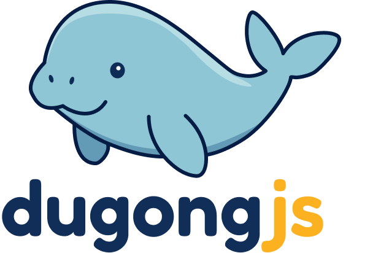

    

An event sourcing framework for Node.js.

## Introduction

Many popular Node.js backend frameworks - such as Express and NestJS - excel at handling networking, request life-cycle management, and other infrastructure-level concerns. However, they often fall short when it comes to guiding developers in structuring complex business logic. Concepts central to domain-driven design (DDD), such as aggregates, domain events, entities and value objects, are left entirely up to the developer to implement. This limitation becomes especially apparent in the world of microservices, where DDD is often the foundational approach.

DugongJS aims to bridge this gap by providing an event sourcing framework to the Node.js ecosystem. It is built on the ports-and-adapters (hexagonal) architecture, making its core components completely framework- and infrastructure agnostic. As a result, it can be integrated with popular frameworks and infrastructure tools simply by implementing suitable adapters.

## Documentation

Documentation is available at [dugongjs.dev](https://dugongjs.dev).
