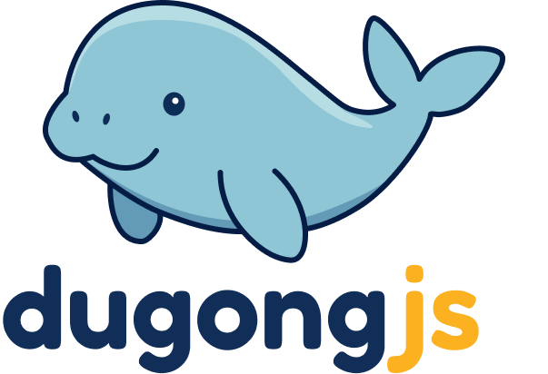

    

An event sourcing framework for Node.js.

**Note:** DugongJS is currently in an experimental phase and does not adhere to semantic versioning. Breaking changes may be introduced in minor or patch releases until version 1.0.0 is released.

## Documentation

Documentation is available at [dugongjs.dev](https://dugongjs.dev).
