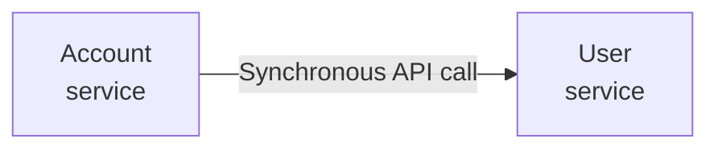
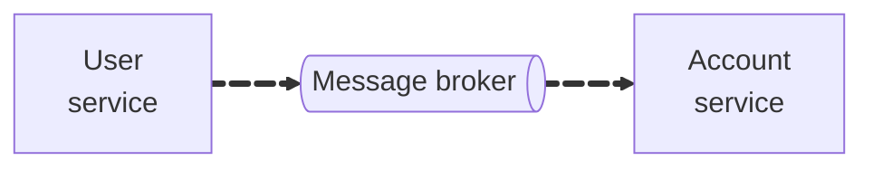
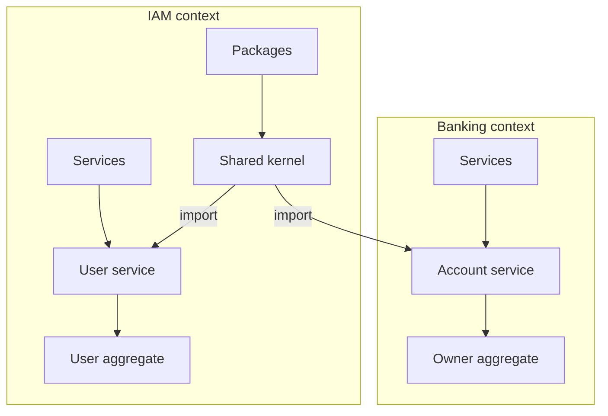

In a microservice architecture, multiple services may need to maintain a local view of aggregates owned by other services. For example, consider the `BankAccount` aggregate discussed in the [aggregate](../core-concepts/aggregates.md#defining-aggregates) documentation. Let’s say we update the `BankAccount` aggregate to reference a user by ID rather than by name. This is a more realistic setup for systems operating across service boundaries. The `BankAccount` aggregate is owned by the accounting service, but now depends on the `User` aggregate owned by the user service to reference user information.

```typescript
@Aggregate("BankAccount")
export class BankAccount extends AbstractAggregateRoot {
    private ownerId: string;

    public getOwnerId(): string {
        return this.ownerId;
    }

    // Rest of the aggregate...
}
```

The `OpenAccountCommand` would now accept an `ownerId` field, referring to the ID of a `User` aggregate managed by the user service. However, this raises a challenge: the accounting service must validate that the referenced user exists (and perhaps whether they’re eligible to open an account).

:::info
**Why `ownerId` instead of `userId`?**

Domain driven design emphasizes bounded context and ubiquitous language. Although the owning service refers to this entity as a "user", the correct term in the banking context is "owner".
:::

One option is to perform a synchronous API call from the accounting service to the user service during command handling, in the application layer. But this introduces temporal coupling — if the user service is unavailable, account creation fails. This pattern increases coupling and introduces the problem of cascading failures and is generally discouraged in microservice architectures.



A more resilient alternative is asynchronous communication via a message broker. In this case, the accounting service consumes domain events from the user service and builds a local replica of the `User` aggregate.



However, this approach introduces duplication: the `User` aggregate must now exist in both services. While this duplication is in itself not a concern, and can be a valid design choice, it can lead to issues if the user service introduces new events or new rules for event appliers that have not been implemented in the account service. An alternative approach is to extract the common logic into a shared kernel — a library shared between services that encapsulates read-only aggregate logic.

:::note
Be aware that a shared kernel introduces coupling between microservices. If a microservice only requires limited information about an aggregate owned by another microservice, such as wether or not it exists, a shared kernel can introduce unnecessary coupling. In that case, simply duplicating parts of the aggregate may be preferred.
:::

There is one critical distinction between the user service and the accounting service: only the user service owns the `User` aggregate and is allowed to emit domain events for it. The accounting service must only replicate and apply those events. To enforce this boundary, we create a version of the aggregate in the shared kernel that defines only event appliers (a _read-only_ version) — while the owning service adds command handling on top.

If your microservices are organized in a monorepo, the folder structure might look like this:

```json title="monorepo"
└─ 📁 iam-context
│  └- 📁 packages
│  │  └- 📁 domain-events
│  │  └- 📁 shared-kernel
│  └- 📁 services
│  │  └- 📁 authorization-service
│  │  └- 📁 user-service
└─ 📁 banking-context
│  └- 📁 packages
│  │  └- 📁 domain-events
│  └- 📁 services
│  │  └- 📁 account-service
│  │  └- 📁 payment-service
```

The shared kernel can reside in a shared package exposed by the bounded context that owns the aggregate. It can then be shared in the following way:



### Defining the Shared Kernel Mixin

In `iam-context/packages/shared-kernel`, we define a reusable mixin that encapsulates the event appliers for the `User` aggregate:

```typescript
export function WithUserKernel<TBase extends AbstractConstructor<{ delete: () => void }>>(Base: TBase) {
    abstract class AbstractUserKernel extends Base {
        public _username: string;

        public getUsername(): string {
            return this._username;
        }

        @Apply(UserCreatedEvent)
        public applyUserCreated(event: UserCreatedEvent): void {
            const payload = event.getPayload();

            this._username = payload.username;
        }

        @Apply(UserDeletedEvent)
        public applyUserDeleted(): void {
            this.delete();
        }

        // Other event appliers...
    }

    return AbstractUserKernel;
}
```

:::tip
The `AbstractConstructor` type is imported from `@dugongjs/core`.
:::

:::note
Due to limitations with TypeScript mixins, private class fields are not supported inside mixin classes. We prefix them with `_` to indicate that they are considered internal/private.
:::

### Defining the Aggregate (Owning Service)

In `iam-context/services/user-service`, we extend the shared kernel to implement the full aggregate with command handling:

```typescript
@Aggregate("User")
export class User extends WithUserKernel(AbstractAggregateRoot) {
    @CreationProcess()
    public createUser(command: CreateUserCommand): void {
        const event = this.createDomainEvent(UserCreatedEvent, {
            username: command.username
        });

        this.stageDomainEvent(event);
    }

    public deleteUser(): void {
        const event = this.createDomainEvent(UserDeletedEvent);

        this.stageDomainEvent(event);
    }
}
```

### Defining The Replicated Aggregate (Consuming Service)

In `banking-context/services/accounting-service`, we use the same shared kernel mixin to define a replicated version of the aggregate:

```typescript
@ExternalAggregate("User", "IAMContext-UserService")
export class AccountOwner extends WithUserKernel(AbstractEventSourcedAggregateRoot) {}
```

:::tip
`ExternalAggregate` and `AbstractEventSourcedAggregateRoot` are imported from `@dugongjs/core`.
:::

The `@ExternalAggregate()` decorator marks this aggregate as externally owned. The first argument is the `aggregateType`, and the second is the `origin` that identifies the owning context. For more information, see the documentation on [origin](../core-concepts/origin.md).

Because this aggregate extends `AbstractEventSourcedAggregateRoot` instead of `AbstractAggregateRoot`, it lacks the ability to create or stage domain events. It can only be instantiated and updated via event replay. This enforces a clear ownership boundary: the accounting service can observe and apply events but cannot produce new ones for this aggregate.

:::info
**Why `AccountOwner` instead of `User`?**

As stated earlier, in the accounting contexts ubiquitous language, the role of the related entity is that of an “owner”, not a general “user”. We reflect this distinction in the class name by calling it `AccountOwner`. However, note that the `aggregateType` in the `@ExternalAggregate()` decorator must still match the original `"User"` type from the publishing service. This is because domain events consumed by a service must adhere to the publishing services published language when defining the aggregate metadata, but is free to use its own ubiquitous language in the class.

With this setup, the application layer in the accounting service might validate user existence like so:

```typescript
class AccountCommandService {
    // Rest of class...

    public openAccount(command: OpenAccountCommand): Promise<BankAccount> {
        // First, try to build the `AccountOwner` to validate its existence.
        const accountOwner = this.accountOwnerFactory.build(command.ownerId);

        if (!accountOwner) {
            // If the account `AccountOwner` not exist, the command should fail.
            throw new Error(`Owner with ID ${command.ownerId} not found.`);
        }

        const account = new Account();
        account.openAccount(command);

        // Rest of method...
    }
}
```

:::
