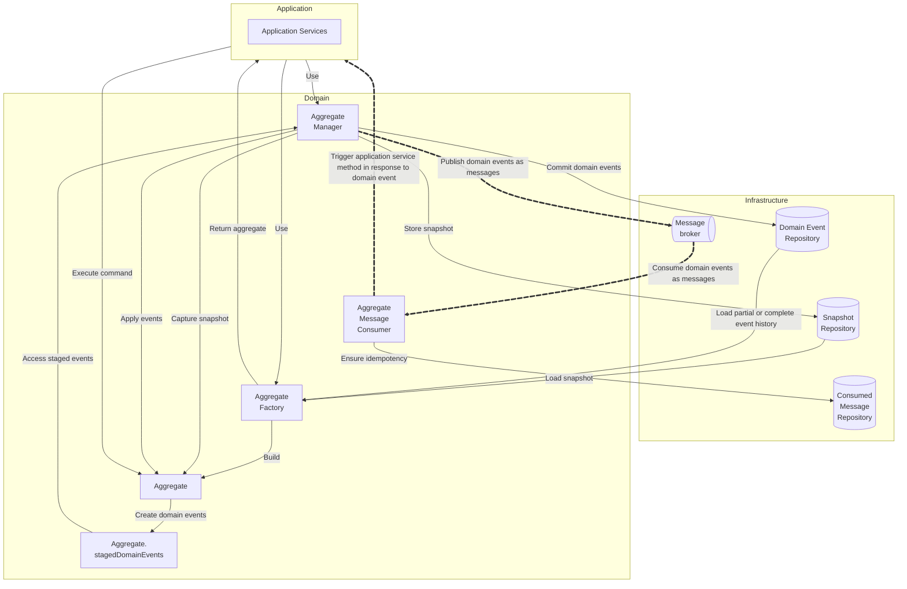

This diagram shows an overview of the core components in the DugongJS architecture and how they interact. Although you do not need to understand the details of this diagram, you can use it as a reference while reading this documentation.

The application layer represents the part of the application that interacts with the outside world, typically a network controller (REST, GraphQL, gRPC, etc.), message consumer or scheduled jobs. The application layer typically defines a set of application services that leverage dependency injection. Application services receive commands and delegates them to [aggregates](./aggregates.md), which encapsulates domain behavior and enforce business rules.

When a command is executed, the aggregate validates the input and, if valid, creates and stages one or more [domain events](./domain-events.md). These events are temporarily held in the aggregate’s `stagedDomainEvents` collection and have not yet been persisted. The **aggregate manager** and **factory** are available to the application services to interact with the domain layer.

When an aggregate instance is needed by application services, the aggregate factory loads the domain event log for that particular aggregate from the domain event repository and then replays subsequent events from the domain event log. This builds an in-memory instance of the aggregate based on the aggregates complete history. As an optional performance improvement, snapshots of the aggregate may be taken to reduce the number of domain events to load and apply. Snapshots are persisted separately in the snapshot repository.

After command execution, the staged domain events generated by the commands are handed off to the aggregate manager. It appends the latest domain events to the event log and may also trigger [snapshotting](../advanced-concepts/snapshotting.md) of the aggregate if certain conditions are met. The aggregate manager can also apply the staged domain events back to the aggregate to update its in-memory state. This is useful when an application service method needs to return an up-to-date view of the aggregate.

Domain events can also be published to a [message](../core-concepts/messages.md) broker for asynchronous communication with other microservices or for triggering up event-driven operations. The **aggregate message consumer** handles the complexities of decoding domain events from messages and persisting them.
