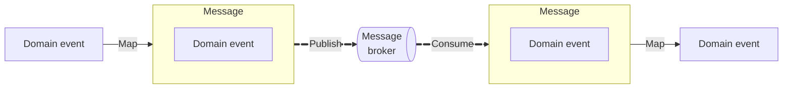
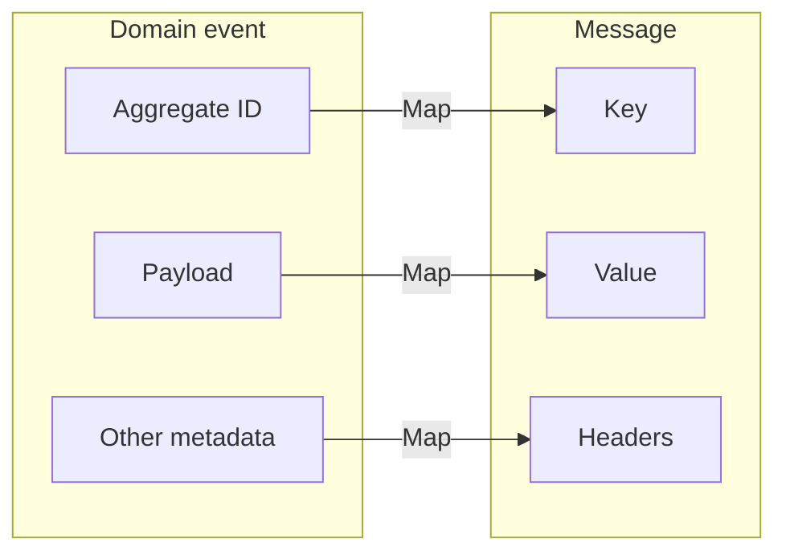

In DugongJS, a **message** refers to a domain event in transit, in the context of a message broker. When a domain event is published as a message, it is mapped into the transport format required by the message broker. This process involves mapping the domain event for transmission and then mapping it back when it is received.

The mapping logic is handled by the inbound and outbound message mapper ports. This abstraction allows DugongJS to remain decoupled from any specific message format or broker protocol.

## Example: Kafka

When publishing domain events to **Kafka**, the `OutboundMessageMapperKafkaJS` adapter maps domain events to satisfy the Kafka message protocol. The structure of a Kafka message is illustrated below:

The aggregate ID is mapped to the message key, the payload to the message value and the rest is mapped to message headers. Mapping the aggregate ID to the Kafka key ensures that all events for a given aggregate are delivered to the same Kafka partition. This guarantees sequential delivery for that aggregate instance in consumers.

:::tip
The `OutboundMessageMapperKafkaJS` is imported from `@dugongjs/kafkajs`.
:::
